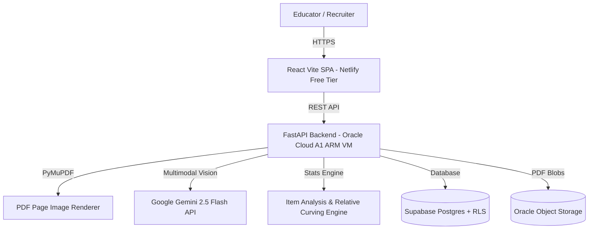

<div align="center">

# 🎓 GradeWise
### **AI-Powered Academic Paper Grading & Psychometric Analytics Platform**

[](LICENSE)
[](https://gradewise.netlify.app/)
[](#)
[](#)
[-purple.svg)](https://github.com/oldregime/gradewise/releases)
[-emerald.svg)](#zero-cost-infrastructure-stack)

*Automates student exam paper grading, digitizes handwritten booklets, extracts Proof of Marking (PoM) rubrics, and delivers class-wide relative grading curves & psychometric item analysis.*

[Live App](https://gradewise.netlify.app/) • [Feature Spec: 1-Click Demo](ideation/03_FEATURE_ONE_CLICK_RECRUITER_DEMO.md) • [Architecture Spec](planning/05_ARCHITECTURE_DIAGRAM.md) • [Zero-Cost Stack Spec](planning/03_ZERO_COST_STACK.md) • [Master Prompt](MASTER_PROMPT.md)

</div>

---

## 🌟 Key Features

1. **📄 Multi-Format Document Ingestion & Parsing**:
   - Accepts scanned handwritten student booklets (PDF) and digital Word/PDF Proof of Marking (PoM) keys.
   - Extracts page images using `PyMuPDF` with bounding-box region mapping.

2. **🧠 Multimodal Vision LLM Rubric Engine**:
   - Evaluates handwritten answers directly in visual context using **Gemini 2.5 Flash** / **GPT-4o Vision**.
   - Generates per-criterion score breakdowns, verbatim quoted evidence, and partial credit justifications.

3. **🖥️ Interactive Split-Screen Grading Studio**:
   - **Left Pane**: High-resolution PDF canvas viewer with AI bounding-box highlights.
   - **Right Pane**: Interactive score sliders, confidence index ratings, evidence quotes, and 1-click grade approval.

4. **📊 Relative Grading & Psychometric Item Analysis**:
   - **Normal Bell Curve (Z-Score)** vs. Absolute Grading scale toggle.
   - **Item Difficulty Index ($P$-value)** & **Discrimination Index ($D$-value)** calculations.
   - **Cronbach's Alpha ($\alpha$)** test reliability score.
   - **Pairwise Cosine Similarity Heatmap** for within-class plagiarism detection.

5. **🔑 Bring Your Own Key (BYOK)**:
   - Supports Teacher-supplied OpenAI or Gemini API keys.
   - Keys are encrypted server-side using **AES-256-GCM** and never exposed to the client.

---

## 🏗️ System Architecture



---

## 💰 Zero-Cost Infrastructure Stack ($0.00/mo Forever)

| Component | Service | Free Quota | Monthly Cost |
| :--- | :--- | :--- | :--- |
| **Frontend** | Netlify | 100 GB Bandwidth, Unlimited Sites | **$0.00** |
| **Backend Compute** | Oracle Cloud Always-Free ARM A1 | 2 OCPU / 12 GB RAM | **$0.00** |
| **Database & Auth** | Supabase Postgres + RLS | 500 MB DB, 50,000 MAUs | **$0.00** |
| **File Storage** | Oracle Object Storage | 20 GB Object Storage | **$0.00** |
| **AI Engine** | Google AI Studio (Gemini 2.5 Flash) | 1,500 Requests / Day | **$0.00** |
| **Reverse Proxy** | Caddy + Let's Encrypt | Automatic SSL | **$0.00** |
| **DNS** | DuckDNS | Free Dynamic DNS | **$0.00** |
| **Total Cost** | | | **$0.00 / month** |

---

## 🚀 Quick Start (Local Development)

### Prerequisites
- Node.js `v20+`
- Python `3.11+`

### 1. Clone & Setup Frontend
```bash
cd frontend
npm install --no-bin-links
node node_modules/vite/bin/vite.js --port 5173
```
*Open [http://localhost:5173](http://localhost:5173)*

### 2. Setup Backend API
```bash
cd backend
python3 -m pip install -r requirements.txt
python3 -m uvicorn app.main:app --reload --port 8000
```
*Open [http://localhost:8000/docs](http://localhost:8000/docs) for Swagger UI*

---

## 🧪 Recruiter Demo Test Walkthrough

Sample test exam papers from **VIT University (CSE2003 Computer Architecture)** are included in `question and answer sheet for testing/`:

1. Open the **Upload Studio** tab in GradeWise.
2. Click **Extract Rubric & Questions with AI** — parses the official Proof of Marking key (`CSE2003 Midterm PoM.pdf`).
3. Click **Start AI Batch Grading & Analysis** — evaluates 11-page and 13-page handwritten student booklets (`DIVYANSH JOSHI 22BCE11364.pdf`).
4. Switch to **Grading Studio** to review PDF canvas bounding-box highlights & partial credit criteria.
5. Switch to **Analytics & Curve** to inspect real-time Z-score Gaussian Bell Curve shifting, Difficulty $P$-values, and Plagiarism heatmaps.

---

## 📂 Repository Structure

```
gradewise/
├── frontend/             # React + Vite + Vanilla CSS Glassmorphic SPA
├── backend/              # Python FastAPI + PyMuPDF + Analytics Engine
├── ideation/             # Product vision & feature roster specs
├── research/             # Open-source benchmarks & psychometric formulas
├── planning/             # System architecture, DB schema & zero-cost specs
├── MASTER_PROMPT.md      # Canonical AI System Prompt & Developer Context
├── CONTEXT.md            # Domain glossary (Ubiquitous Language)
├── TOOLS_AND_SKILLS.md   # Developer CLI & Tooling Reference
├── docker-compose.yml    # Oracle VM container stack
├── Caddyfile             # Reverse proxy config
└── LICENSE               # MIT License
```

---

## 📄 License

This project is open-source under the [MIT License](LICENSE).
