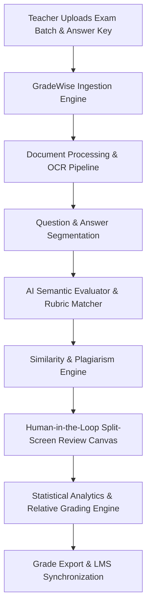

# GradeWise — AI-Powered Grading & Statistical Analytics Engine

> **Elevating Educator Productivity with Autonomous Paper Digitization, Semantic Rubric Grading, & Class-Wide Analytics.**

---

## 1. Vision & Core Philosophy

Grading subjective student papers, exam sheets, and handwritten answer scripts is one of the most time-consuming, prone-to-bias, and tedious responsibilities for educators worldwide. 

**GradeWise** transforms this workflow into an **intelligent, semi-autonomous assistant** that:
1. **Digitizes & Segments**: Accepts digital PDFs, Word documents, or messy handwritten student scans, automatically segmenting questions and answers.
2. **Grades with Precision**: Evaluates student responses against official question papers, rubrics, and answer keys using Multimodal LLMs (Gemini / GPT-4o) combined with traditional NLP similarity metrics.
3. **Empowers Teachers with Human-in-the-Loop Review**: Provides an interactive split-screen paper viewer with AI-suggested scores, highlighted reasoning, and rapid inline rubric adjustments.
4. **Delivers Deep Statistical Insights**: Computes class-wide relative grading curves (Gaussian, Z-Score, Percentiles), item difficulty indices ($P$-value), item discrimination ($D$-value), and student proficiency clusters.

---

## 2. Target Persona & User Stories

### **Primary Persona: Professor / Educator / Teaching Assistant**
* **Pain Point**: Grading 200+ handwritten or typed exam papers takes 30+ hours per exam, leads to inconsistent scoring between early and late papers, and lacks comparative statistical feedback.
* **Goal**: Upload exam papers in batch, let GradeWise perform preliminary grading in minutes, review low-confidence answers in a sleek split-screen UI, adjust grading curves dynamically, and publish grades.

---

## 3. High-Level Feature Architecture

---

## 4. Key Differentiating Features

1. **Multimodal OCR & Layout Understanding**: Handles both structured digital text (DOCX/PDF) and messy handwritten student scripts.
2. **Dynamic Rubric Scoring**: Teachers can upload structured rubrics or let GradeWise auto-generate a rubric from a sample answer key.
3. **Confidence-Weighted AI Scoring**: Every score is accompanied by an AI confidence index. High-confidence grades can be auto-approved; low-confidence grades are highlighted for teacher review.
4. **Interactive Relative Grading (Curve Engine)**: Real-time curve adjuster (Absolute vs. Bell Curve vs. Z-Score vs. Custom Percentile thresholding).
5. **Item Analysis & Pedagogy Insights**: Identifies "trick questions", questions where the class struggled, and overall test reliability ($KR-20$ / Cronbach's Alpha).

---

## 5. Phased Roadmap Overview

* **Phase 1: Ideation** *(Current)* — Concept definition, feature scoping, test data analysis, and domain modeling.
* **Phase 2: Research** *(Current)* — Deep research into open-source autograders (Submitty, OKpy, AssessmentAI), OCR/Vision LLM engines, relative grading algorithms, and modern UI inspiration.
* **Phase 3: Planning** — Architecture blueprint, API contracts, data schema, UI wireframes, and component hierarchy.
* **Phase 4: Execution** — Full-stack implementation (Frontend UI, AI backend, document parser, statistical analytics engine) and end-to-end verification against test papers.
