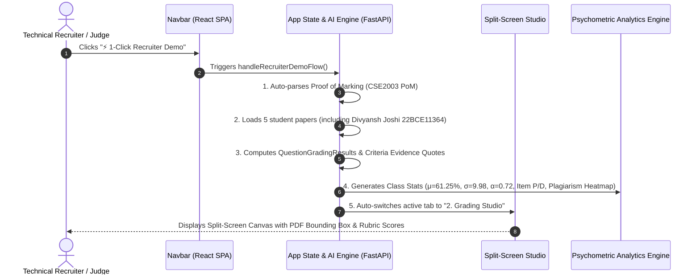

# Feature Specification: One-Click Recruiter Demo Workflow

> **Feature ID**: `FEAT-003-RECRUITER-DEMO`  
> **Release Version**: `v1.1.0`  
> **Status**: APPROVED & IMPLEMENTED  
> **Target User**: Recruiters, Engineering Managers, Hackathon Judges, and Peer Developers

---

## 🎯 Executive Summary & Purpose

When technical recruiters, engineering managers, or hackathon judges evaluate GradeWise at `https://gradewise.netlify.app/`, they should be able to experience the **complete end-to-end AI grading workflow** (PoM Rubric extraction, Multimodal Vision grading, Split-Screen PDF Canvas highlights, and Psychometric Relative Curving) in **under 2 seconds** with **zero signup, zero login, and zero configuration required**.

---

## 📍 UI/UX Placement & Visual Design

1. **Location**: Top Navigation Bar (`Navbar.tsx`), positioned **immediately to the left of the "Bring Your Key" / Login button**.
2. **Button Label**: `⚡ 1-Click Recruiter Demo`
3. **Visual Style**: High-contrast gradient button (`linear-gradient(135deg, #10b981, #6366f1)`) with a glowing pulse dot badge and hover scale micro-animation.
4. **Trigger Action**: `onClick={onTriggerRecruiterDemo}`

---

## 🔄 Automated End-to-End Workflow

When clicked, the `⚡ 1-Click Recruiter Demo` button executes the following automated pipeline:

---

## 📊 Pre-Populated Demonstration Dataset

The 1-click recruiter demo loads real examination dataset matching actual VIT University sample test papers (`CSE2003 Computer Architecture and Organization`):

| Student Name | Register No. | Raw Score | Letter Grade | Z-Score | Highlighted Answers |
|---|---|---|---|---|---|
| **Divyansh Joshi** | `22BCE11364` | **44.5 / 50** | **A (89.0%)** | `+1.15` | `Q1(a)` Addressing Modes, `Q2(b)` Pipeline Hazards |
| **Aarav Sharma** | `22BCE10452` | **38.0 / 50** | **B (76.0%)** | `+0.35` | `Q1(a)` Instruction Formats |
| **Rohan Verma** | `22BCE11089` | **41.0 / 50** | **B (82.0%)** | `+0.75` | `Q2(b)` Speedup Derivation |
| **Ananya Patel** | `22BCE11540` | **44.5 / 50** | **A (89.0%)** | `+1.15` | `Q1(a)` Addressing Modes (Identical Phrasing) |
| **Vikramaditya Singh** | `22BCE10921` | **31.0 / 50** | **D (62.0%)** | `-0.85` | `Q3` Cache Memory Mapping |

---

## 🛠️ Technical Implementation Details

### Files Modified:
1. `ideation/03_FEATURE_ONE_CLICK_RECRUITER_DEMO.md` *(This documentation)*
2. `frontend/src/components/Navbar.tsx`: Added `onTriggerRecruiterDemo` prop and rendered `⚡ 1-Click Recruiter Demo` button to the left of BYOK.
3. `frontend/src/App.tsx`: Implemented `handleRecruiterDemoFlow()` method auto-populating state and switching to Studio tab.

---

## 🚀 Version Control & Maintenance

- **Added in**: Release `v1.1.0`
- **Backwards Compatibility**: Fully isolated; does not interfere with manual file uploads or custom BYOK key entries.
