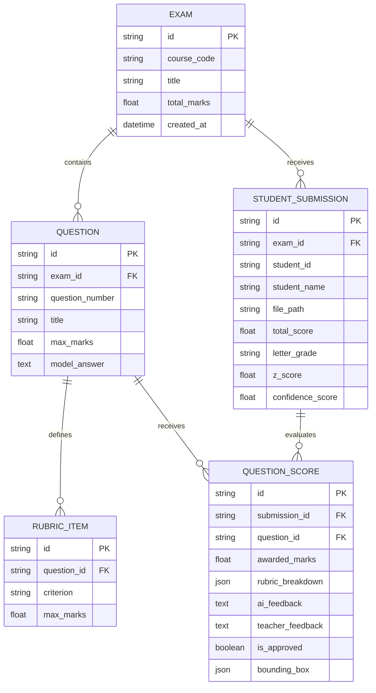

# System Architecture & Technical Specifications

---

## 1. Technology Stack Selection

GradeWise utilizes a high-performance web architecture:

| Tier | Component / Technology | Justification |
| :--- | :--- | :--- |
| **Frontend UI** | **React + Vite** | High rendering performance, fast HMR, component modularity. |
| **Styling** | **Vanilla CSS & Modern Design Tokens** | Flexible design system with glassmorphism, HSL color system, custom dark mode, responsive grid layout. |
| **Icons & Visuals** | **Lucide-React & Canvas API / PDF.js** | Crisp icons, native PDF page rendering with canvas overlay for bounding box highlights. |
| **Charts & Analytics** | **Chart.js / Recharts & MathJax / KaTeX** | Smooth animated histograms, scatter plots, box plots, and mathematical formula rendering. |
| **Backend Engine** | **Python FastAPI** (or Node.js Express server with Python workers) | Native integration with PyMuPDF, Scikit-learn, NumPy, SciPy, and AI SDKs (Google Gemini / OpenAI). |
| **AI Models** | **Gemini 2.0 Flash / GPT-4o Vision** | Fast multimodal visual reasoning on handwritten student answer sheets with JSON output constraints. |

---

## 2. API Schema Blueprint

### 📤 1. Ingestion Endpoints
* `POST /api/v1/exams/create` — Create new exam workspace (Course Code, Exam Title, Total Marks).
* `POST /api/v1/exams/{id}/upload-pom` — Upload Proof of Marking / Answer Key (PDF/DOCX). Extracted into question rubrics.
* `POST /api/v1/exams/{id}/upload-submissions` — Batch upload student answer scripts (PDFs/DOCX).

### 🤖 2. Grading & AI Processing
* `POST /api/v1/exams/{id}/process-ai` — Trigger full AI segmentation & grading pipeline.
* `GET /api/v1/exams/{id}/submissions/{sub_id}` — Get detailed student submission, extracted question images, AI scores, and bounding boxes.
* `PUT /api/v1/exams/{id}/submissions/{sub_id}/grades` — Update/Override teacher marks and feedback.

### 📊 3. Analytics & Relative Grading
* `GET /api/v1/exams/{id}/analytics` — Fetch class statistics (Mean, Median, SD, Min, Max, Cronbach Alpha, Item Difficulty & Discrimination).
* `POST /api/v1/exams/{id}/relative-curve` — Apply relative grading curve parameters (Target Mean, Target SD, Mode: Gaussian / Z-score / Percentile). Returns updated grade assignments.
* `GET /api/v1/exams/{id}/similarity-matrix` — Fetch pairwise student similarity scores for plagiarism detection.

---

## 3. Data Schema & Models

