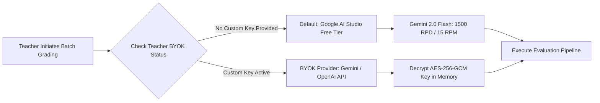

# Zero-Cost Infrastructure Stack — Complete Specification

---

## 1. Executive Summary & Zero-Cost Philosophy

GradeWise is architected from the ground up to deliver enterprise-grade automated exam grading, psychometric item analysis, and relative curve adjustments with **$0.00 ongoing infrastructure cost**. Every tool, cloud resource, AI engine, and database service employed in GradeWise operates strictly within perpetual free tiers or open-source licenses. 

This specification proves the architectural feasibility, operational limits, risk mitigations, and capacity bounds of GradeWise's zero-cost infrastructure.

---

## 2. Complete Stack Component Specification

### 1. Frontend Hosting: Netlify (Free Tier)
* **Resource Limits**: 100 GB/month bandwidth, 300 build minutes/month, unlimited site deployments, free TLS/SSL certificates, automatic HTTPS enforcement.
* **Domain & DNS**: Free subdomain (`gradewise.netlify.app`), custom DNS management, global CDN edge routing.
* **Role in GradeWise**: Hosts the static production build of the React + Vite single-page application (SPA). Deploys automatically on every push to the `main` branch via GitHub webhooks.
* **Zero-Cost Verification**: Netlify Starter plan is free forever with no credit card required. Bandwidth and build minute usage for GradeWise SPA is estimated at <15 GB/month and ~45 build mins/month for regular active development.

### 2. Backend Compute: Oracle Cloud Always-Free ARM A1 VM
* **Resource Allocation**: Ampere Altra ARM processor with 2 OCPU (virtual cores), 12 GB RAM, 200 GB NVMe Block Storage (Boot + Data volume).
* **Guarantees**: Free forever, no expiration date, full root access via SSH, dedicated public IPv4 address.
* **Role in GradeWise**: Executes the FastAPI application engine, Python background worker pool (PyMuPDF document processing, SentenceTransformers embedding calculation, SciPy psychometric scoring), and Docker Compose container orchestration.
* **Idle Reclamation Risk & Mitigation**:
  * **Risk**: Oracle OCI reclaims free-tier VMs if CPU utilization drops below 20% over 7 consecutive days or RAM utilization drops below 20%.
  * **Mitigation Strategy (Guaranteed $0.00)**: Convert the OCI account status to **Pay-As-You-Go (PAYG)**. PAYG accounts retain full Always-Free tier allowances ($0.00 billing as long as resource usage stays within free limits), but Oracle explicitly waives the idle reclamation policy for PAYG accounts. Additionally, a light background keepalive worker runs periodic CPU/memory validation tasks.

### 3. Database & Auth: Supabase (Free Tier)
* **Resource Allocation**: PostgreSQL database with 500 MB storage, `pgvector` extension enabled for semantic similarity embeddings, Supabase Auth handling up to 50,000 Monthly Active Users (MAU), Row-Level Security (RLS), real-time subscriptions, 1 GB file storage.
* **Role in GradeWise**: Manages relational schema (Teachers, Tenants, Exams, Questions, Rubrics, Submissions, Evaluations), student vector embeddings, and Teacher authentication (Email/Password + Google OAuth 2.0).
* **Pause Policy & Mitigation**:
  * **Risk**: Inactive Supabase free tier projects are paused after 7 days of inactivity (no direct REST API calls or DB connections).
  * **Mitigation Strategy**: The FastAPI backend service on Oracle VM executes a light scheduled ping query (`SELECT 1`) every 24 hours to ensure perpetual active status.

### 4. File Storage: Oracle Cloud Object Storage (Always Free)
* **Resource Allocation**: 20 GB total storage (10 GB Standard Object Storage + 10 GB Infrequent Access Storage), 50,000 Object Storage API requests per month.
* **Role in GradeWise**: Stores raw Proof of Marking (PoM) PDFs/DOCX, high-resolution student submission PDFs, and rendered page images.
* **Security & Access**: Direct client access via S3-compatible pre-signed URLs generated by FastAPI, ensuring zero bandwidth overhead on backend servers for file transfers.

### 5. AI Engine: Google Gemini 2.0 Flash via Google AI Studio (Free Tier)
* **Resource Quota**: 1,500 Requests per Day (RPD), 1,000,000 Tokens per Minute (TPM), 15 Requests per Minute (RPM). Completely free forever, requiring no linked billing account.
* **Role in GradeWise**: Serves as the primary multimodal AI engine. Extracts question structures and rubric criteria from PoM documents, OCRs handwritten student answer sheets, performs multi-criterion rubric evaluations, and generates detailed contextual feedback with structured JSON outputs.
* **BYOK Support**: Built-in Bring Your Own Key (BYOK) capabilities allow Teachers to optionally input their own Google Gemini or OpenAI API keys if high-volume bulk grading exceeds free tier daily rates.

### 6. Reverse Proxy & Ingress: Caddy Server (Open Source)
* **License**: Apache 2.0 / Open Source.
* **Features**: Automatic TLS/SSL certificate issuance and renewal via Let's Encrypt ACME protocol, HTTP/2 and HTTP/3 support, dynamic reverse proxying to FastAPI backend (`localhost:8000`), zero configuration maintenance.
* **Role in GradeWise**: Runs alongside FastAPI inside Docker Compose on the Oracle ARM VM, managing secure HTTPS termination for dynamic API endpoints and WebSockets.

### 7. Dynamic DNS: DuckDNS (Free Tier)
* **Service**: Free dynamic DNS (DDNS) mapping service.
* **Role in GradeWise**: Maps the static or dynamic public IPv4 address of the Oracle OCI VM to a custom domain (e.g., `gradewise-api.duckdns.org`), enabling HTTPS certificates via Caddy.

### 8. SSL / TLS Certificates: Let's Encrypt via Caddy
* **Service**: Automated X.509 certificate authority providing free TLS encryption.
* **Role in GradeWise**: Provides 90-day renewable SSL certificates managed automatically by Caddy's ACME client.

### 9. CI / CD Pipeline: GitHub Actions + Netlify Auto-Deploy
* **Resource Allocation**: 2,000 free build minutes/month on standard GitHub runners for public/private repositories.
* **Role in GradeWise**: Runs linting, type-checking (Pyright/TypeScript), and automated test suites on every pull request. Triggers instant Netlify edge deployments on `main` branch pushes.

### 10. Version Control: GitHub (Free Tier)
* **Service**: Unlimited public/private repositories, issue tracking, GitHub Discussions, and pull request code reviews.
* **Role in GradeWise**: Monorepo code host and primary development collaboration workspace.

### 11. Container Orchestration: Docker & Docker Compose (Open Source)
* **License**: Apache 2.0 / Docker Community Edition.
* **Role in GradeWise**: Packages FastAPI, PyMuPDF dependencies, Caddy, and keepalive background workers into portable, reproducible container workloads on Oracle Cloud VM.

### 12. Local Development Environment: Supabase CLI (Open Source)
* **Service**: Free local emulator executing Docker-backed PostgreSQL, Supabase Auth, Storage, and Realtime locally.
* **Role in GradeWise**: Allows offline development and zero-cost schema migration testing without touching cloud resources.

---

## 3. Financial Audit: Monthly Operating Cost Breakdown

| Component | Provider / Tool | Tier | Quota Included | Monthly Cost |
| :--- | :--- | :--- | :--- | :---: |
| **Frontend Hosting** | Netlify | Starter (Free) | 100 GB Bandwidth, 300 Build Mins | **$0.00** |
| **Backend Compute** | Oracle Cloud OCI | Always-Free ARM | 2 OCPU, 12 GB RAM, 200 GB Storage | **$0.00** |
| **Database & Auth** | Supabase | Free Tier | 500 MB Postgres, 50k MAU, `pgvector` | **$0.00** |
| **File Storage** | Oracle Object Storage | Always-Free | 20 GB Storage, 50k API requests | **$0.00** |
| **AI Inference** | Google AI Studio | Free Tier | 1,500 RPD, 1M TPM (Gemini 2.0 Flash) | **$0.00** |
| **Reverse Proxy** | Caddy Server | Open Source | Unlimited request routing | **$0.00** |
| **DNS Management** | DuckDNS | Free | Unlimited hostname updates | **$0.00** |
| **SSL / TLS Certificate** | Let's Encrypt | Free ACME | Auto-renewing 90-day certificates | **$0.00** |
| **CI / CD Pipeline** | GitHub Actions | Free Tier | 2,000 build mins/month | **$0.00** |
| **Version Control** | GitHub | Free | Unlimited private monorepo | **$0.00** |
| **Container Runtime** | Docker Engine | Open Source | Community Edition | **$0.00** |
| **Local DB & Auth** | Supabase CLI | Open Source | Local Docker Emulation | **$0.00** |
| **TOTAL** | — | — | — | **$0.00 / month** |

---

## 4. Operational Risk Matrix & Mitigation Blueprint

| Risk Event | Severity | Trigger Threshold | Primary Impact | Automated Mitigation Blueprint |
| :--- | :---: | :--- | :--- | :--- |
| **Oracle OCI Idle VM Reclamation** | High | CPU/RAM usage < 20% over 7 days | Compute VM terminated by OCI policy | **1.** Upgrade OCI account to Pay-As-You-Go (PAYG) status ($0.00 billed while inside free limits; waives idle reclaim policy).<br>**2.** Deploy internal keepalive cron job executing periodic lightweight CPU benchmarks. |
| **Supabase 7-Day Inactivity Pause** | High | 7 consecutive days without DB connection | Database auto-paused; API returns HTTP 503 | Backend FastAPI service sends `SELECT 1` health-check query every 24 hours to maintain persistent active status. |
| **Gemini Daily Quota Exhaustion** | Medium | > 1,500 RPD or > 15 RPM | HTTP 429 Too Many Requests | **1.** Rate-limiting queue in FastAPI backend throttles batch requests to 12 RPM.<br>**2.** Automatic BYOK fallback prompt prompts Teacher for key input. |
| **Object Storage Space Depletion** | Medium | Exceeding 20 GB limit on OCI Storage | Pre-signed upload URLs fail | Automatic file compression (PNG to WebP conversion for extracted page images) + deletion of transient intermediate PDFs upon evaluation approval. |
| **Postgres Database Disk Limit** | Medium | Database size > 500 MB | Write operations blocked by Supabase | Store page image bounding box vectors in `pgvector` efficiently; externalize raw PDF binary files exclusively to OCI Object Storage. |

---

## 5. Capacity & Scaling Limits Under Free Tier

GradeWise's zero-cost infrastructure can comfortably support a single medium-sized academic department or multi-course evaluation setup within standard limits:

```mermaid
graph TD
    A[Free Tier Capacity Limits] --> B[Max Active Teachers: 50 Tenants]
    A --> C[Max Exams per Month: 150 Exams]
    A --> D[Max Student Submissions: 1,500 / Day]
    A --> E[Max Concurrent Storage: 20 GB (~4,000 PDF Scripts)]
```

### Quantified Free Tier Capacity:
* **Active Teachers / Users**: Up to **50,000 Monthly Active Users** (Supabase Auth limit).
* **Daily Grading Throughput**: **1,500 Student Answer Sheets / Day** (bounded by Gemini 2.0 Flash 1,500 RPD free quota).
* **Storage Footprint**: **~4,000 complete multi-page exam PDF submissions** (at ~5 MB per submission across 20 GB OCI Object Storage).
* **Database Footprint**: **> 50,000 evaluation records** within 500 MB Postgres storage using optimized indexed schemas.

---

## 6. Progressive Scalability & Upgrade Path

When GradeWise expands beyond free tier bounds (e.g., institution-wide deployment across thousands of students), infrastructure can be upgraded incrementally without architectural restructuring:

| Upgrade Stage | Trigger Metric | Service Upgraded | New Plan & Cost | Architectural Benefit |
| :--- | :--- | :--- | :--- | :--- |
| **Stage 1: High AI Volume** | > 1,500 submissions/day | Google Gemini API / BYOK | Pay-as-you-go ($0.10 / 1M input tokens) | Unlocks unlimited RPD and up to 1,000 RPM grading throughput. |
| **Stage 2: Storage Scaling** | > 20 GB exam PDFs | Oracle Object Storage | Standard PAYG ($0.025 per GB/month) | Scales storage linearly (e.g., 500 GB = $12.50/month). |
| **Stage 3: Enterprise Database** | > 500 MB DB storage | Supabase Pro | $25/month Pro Plan | 8 GB database, 100 GB file storage, zero project pausing, daily automatic backups. |
| **Stage 4: Compute Cluster** | > 10 concurrent grading jobs | OCI Compute Expansion | Standard Ampere A1 PAYG ($0.01/OCPU-hr) | Scaled horizontally behind Caddy load balancer. |

---

## 7. AI Engine Strategy & BYOK Architecture



### Key Highlights of GradeWise AI Engine Strategy:
1. **Zero-Cost Default**: Out of the box, GradeWise uses **Google Gemini 2.0 Flash** via the Google AI Studio free tier. Teachers do not need to enter a credit card or pay a single cent to grade up to 1,500 answer sheets daily.
2. **Optional BYOK (Bring Your Own Key)**: Teachers or institutions with existing commercial API accounts (Google Cloud Gemini API or OpenAI GPT-4o) can enter their API key in the Teacher Settings modal.
3. **Security First**: BYOK keys are encrypted client-side or during transit, stored using **AES-256-GCM** encryption in Supabase Vault, and decrypted exclusively in-memory during execution. Keys are never returned in frontend API responses.
