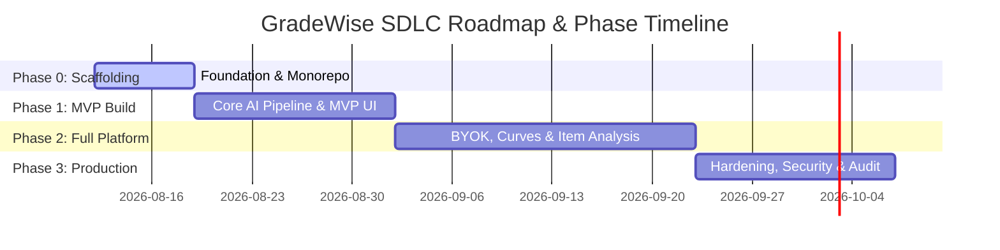
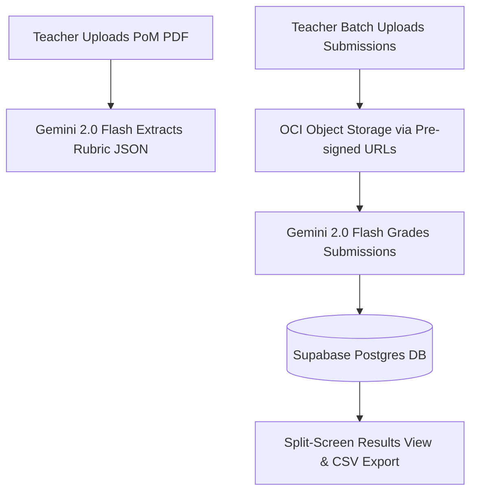

# SDLC Plan & MVP Specification

---

## 1. Executive Overview & Development Lifecycle Structure

The GradeWise platform is built following an agile, phase-gated Software Development Lifecycle (SDLC) optimized for speed, precision, quality, and complete transparency. The project spans 4 core phases over 8 weeks, progressing from infrastructure scaffolding to an MVP (Hackathon Ready), followed by feature complete implementation and production hardening.



---

## 2. Phase Breakdown & Feature Roadmap

### 🏗️ Phase 0: Foundation & Infrastructure Scaffolding (Week 1)

#### Core Objectives:
Establish the monorepo structure, initialize local development dependencies, provision zero-cost cloud services, execute database schema migrations, and wire basic CI/CD deployments.

#### Deliverables Checklist:
- [ ] **Monorepo Architecture**: Initialize GitHub repo containing `frontend/` (React+Vite), `backend/` (FastAPI), `supabase/` (migrations/config), and `docker/` configuration.
- [ ] **Oracle ARM VM Provisioning**: Provision Oracle OCI Always-Free ARM A1 instance (2 OCPU, 12GB RAM) via OCI CLI; configure SSH access and Security Lists (Ports 80, 443, 22).
- [ ] **Supabase Cloud Project Initialization**: Create Supabase project, enable `pgvector` extension, configure Auth providers (Email/Password + Google OAuth 2.0).
- [ ] **Netlify Edge Site Creation**: Create Netlify site linked to the GitHub monorepo for automatic SPA deployments.
- [ ] **Docker Compose Scaffold**: Build multi-container orchestration configuration (`docker-compose.yml`) containing FastAPI engine, Caddy web server, and keepalive background worker.
- [ ] **Database Schema & RLS Policies**: Execute PostgreSQL migration scripts setting up Tenants, Teachers, Exams, Questions, Rubrics, Submissions, and Evaluations tables with strict Row-Level Security (RLS).

#### Definition of Done (DoD):
1. `supabase status` shows local PostgreSQL, Auth, and Storage services running cleanly.
2. Netlify auto-deploys a skeleton React home screen on every push to `main`.
3. `curl https://gradewise-api.duckdns.org/health` returns `{"status": "ok", "db": "connected"}` from Oracle ARM VM.

#### Testing Criteria & Verification Commands:
```bash
# Verify local Supabase DB & Auth containers
supabase status

# Run database schema migration tests
supabase test db

# Test backend API health check endpoint locally
cd backend && pytest tests/test_health.py
```

#### AI Skills to Utilize:
* `codebase-design`: Monorepo structure, modular separation of concerns.
* `workers-best-practices` / `cloudflare`: Docker and API backend best practices.

---

### 🚀 Phase 1: MVP — Hackathon Ready (Week 2–3)

#### Core Objectives:
Deliver a fully functional, end-to-end automated exam grading prototype capable of ingesting a Proof of Marking (PoM), processing student submission answer sheets with Gemini 2.0 Flash, displaying results in a split-screen UI, generating basic analytics, and exporting CSV grade sheets.

#### Feature Matrix (MVP Scope):
1. **Auth & Tenant Onboarding**: Teacher signup/login with Supabase Auth (Email + Google OAuth).
2. **Exam Creation Studio**: Modal form to specify Course Code, Exam Title, and Total Allocation Marks.
3. **PoM Extraction Engine**: PDF/DOCX PoM parser using PyMuPDF + Google Gemini 2.0 Flash to extract Question hierarchy and structured Rubric JSON.
4. **Batch Submission Upload**: Direct client-to-cloud PDF answer sheet upload using OCI Object Storage pre-signed S3 URLs.
5. **AI Evaluation Pipeline**: Sequential Gemini 2.0 Flash multimodal grading of handwritten student answers against extracted rubric criteria.
6. **Split-Screen Grading UI**: PDF document viewer on the left; AI scores, criterion breakdown, and feedback on the right.
7. **Basic Analytics Dashboard**: Class mean score calculation and interactive score distribution histogram (Chart.js / Recharts).
8. **CSV Grade Sheet Export**: One-click download of student register numbers, raw scores, and letter grades.



#### Deliverables Checklist:
- [ ] Working Auth flow with persistent session state in React.
- [ ] PoM parser converting raw PDFs into machine-readable Rubrics.
- [ ] Pre-signed URL upload handler for high-volume student PDFs.
- [ ] Multimodal AI grading worker returning structured JSON evaluations.
- [ ] Interactive split-screen review component with mark adjustment triggers.
- [ ] Exportable CSV spreadsheet generation module.

#### Definition of Done (DoD):
1. Uploading `CSE2003 Midterm PoM.docx` automatically populates the exam question structure and rubrics without manual entry.
2. Ingesting `DIVYANSH JOSHI 22BCE11364 CSE2003.pdf` produces a complete evaluated score breakdown within 15 seconds.
3. CSV file downloads accurately reflect raw scores and student registration details.

#### Testing Criteria & Verification Commands:
```bash
# Test PoM Rubric Extraction against sample dataset
cd backend && pytest tests/test_pom_extraction.py -v

# Test End-to-End AI Submission Evaluation
cd backend && pytest tests/test_grading_pipeline.py -v
```

#### AI Skills to Utilize:
* `vibe-coding-starter`: Accelerated frontend prototyping for split-screen studio.
* `frontend-design`: High-contrast, responsive UI styling and layout.
* `prototype`: Rapid validation of Gemini API JSON schema responses.

---

### 🎛️ Phase 2: Full Platform — Advanced Analytics & BYOK (Week 4–6)

#### Core Objectives:
Expand GradeWise into a comprehensive grading intelligence platform featuring Bring Your Own Key (BYOK) security, interactive relative grading curve models, full psychometric item analysis, visual bounding-box highlights, and automated student answer plagiarism detection.

#### Core Features:
1. **BYOK Security Framework**: Teacher Settings modal for custom OpenAI/Gemini keys; AES-256-GCM vault encryption; just-in-time in-memory decryption.
2. **Bounding Box Canvas Overlay**: Visual highlight overlay in PDF viewer showing exact region where AI extracted student evidence.
3. **Interactive Relative Grading Studio**: Real-time bell curve preview with interactive standard deviation ($\sigma$) and target mean sliders; support for Gaussian, $Z$-Score, and Percentile models.
4. **Psychometric Item Analysis Engine**: Automated calculation of Question Difficulty Index ($P$), Discrimination Index ($D$), and Cronbach's Alpha ($\alpha$) reliability coefficient.
5. **Plagiarism & Similarity Detection**: Pairwise student answer cosine similarity calculation using `SentenceTransformers` embeddings.
6. **Student Identity Extraction & Fallback UI**: Automatic OCR recognition of cover-page Register Numbers with manual teacher override UI.
7. **Multi-Tenant Isolation Audit**: Enforce strict Row-Level Security (RLS) policies verifying complete cross-tenant data isolation.

#### Deliverables Checklist:
- [ ] Encrypted BYOK key management module in FastAPI + Supabase.
- [ ] Bounding box coordinate render overlay on React canvas viewer.
- [ ] Live Gaussian curve renderer with dynamic grade distribution updates.
- [ ] Psychometric item analysis calculations ($P$-value, $D$-value, Cronbach's $\alpha$).
- [ ] SentenceTransformers cosine similarity matrix and heatmap component.
- [ ] Full multi-tenant isolation unit test suite.

#### Definition of Done (DoD):
1. Adjusting the curve slider updates student letter grades instantly across the entire class batch in real time.
2. Item Analysis correctly flags questions with $D < 0.20$ as needing review.
3. Plagiarism detector identifies identical text submissions with similarity score $\ge 0.85$.
4. RLS tests confirm Tenant A cannot query or read Tenant B's exams or submissions under any condition.

#### Testing Criteria & Verification Commands:
```bash
# Test Statistical Relative Curve & Psychometric Algorithms
cd backend && pytest tests/test_psychometrics.py -v

# Run Pairwise Plagiarism Embeddings Benchmark
cd backend && pytest tests/test_similarity.py -v

# Run RLS Multi-Tenant Security Verification Suite
supabase test db tests/rls_isolation.test.sql
```

#### AI Skills to Utilize:
* `domain-modeling`: Statistical relative grading and psychometric formulas.
* `codebase-design`: Modular item analysis engine and similarity vectors.
* `code-review`: Auditing multi-tenant security boundaries and RLS policies.

---

### 🛡️ Phase 3: Production Hardening, Optimization & Release (Week 7–8)

#### Core Objectives:
Perform end-to-end performance tuning, harden exception handling, implement health check monitoring, finalize documentation, and prepare demo assets.

#### Deliverables Checklist:
- [ ] **Performance Optimization**: Lazy-loading PDF page renders, WebP image compression, FastAPI response caching.
- [ ] **Fault Tolerance & Retries**: Exponential backoff retry logic for AI API rate limits (HTTP 429 / 503).
- [ ] **Monitoring & Keepalive**: Caddy log exporter, health check endpoints (`/healthz`), Oracle VM keepalive script.
- [ ] **Documentation**: Comprehensive root `README.md`, API documentation, deployment guides.
- [ ] **Demo & Presentation**: 3-minute video demo script, walkthrough video, sample grading test kit.

#### Definition of Done (DoD):
1. System achieves Lighthouse performance score $\ge 90$ on frontend SPA.
2. AI grading pipeline automatically recovers from simulated network dropouts or API rate limits.
3. Zero unresolved high-severity bugs or linter warnings across monorepo.

#### Testing Criteria & Verification Commands:
```bash
# Run full monorepo linting and type checking
npm run lint && cd backend && flake8 && mypy main.py

# Run full end-to-end automated test suite
npm run test:e2e
```

#### AI Skills to Utilize:
* `web-perf`: Lighthouse audit, canvas performance tuning, asset optimization.
* `diagnosing-bugs`: Stress testing and fault recovery validation.

---

## 3. Comprehensive Local Development Setup

Follow these exact commands to configure, run, and test GradeWise on a local development workstation.

### Step 1: Repository Clone & Structure Setup
```bash
# 1. Clone the repository
git clone https://github.com/gradewise/gradewise.git
cd gradewise

# Repository Directory Structure overview:
# gradewise/
# ├── frontend/          # React + Vite SPA (Vanilla CSS, Lucide, PDF.js, Chart.js)
# ├── backend/           # FastAPI application engine & Python background workers
# ├── supabase/          # PostgreSQL migrations, seed data, and RLS policies
# ├── docker/            # Docker Compose, Caddy server config, and Dockerfiles
# └── planning/          # Architectural specs, zero-cost analysis, and SDLC docs
```

### Step 2: Local Database & Auth (Supabase CLI)
```bash
# 1. Ensure Docker Desktop is running on your machine
# 2. Start local Supabase emulation instance (PostgreSQL, Auth, Storage, Vector)
supabase start

# 3. Apply database schema migrations and seed test data
supabase db reset
```

### Step 3: Backend FastAPI Server Execution
```bash
# 1. Navigate to backend directory
cd backend

# 2. Create and activate virtual environment
python -m venv venv
source venv/bin/activate  # On Windows: venv\Scripts\activate

# 3. Install Python dependencies
pip install -r requirements.txt

# 4. Copy environment configuration template
cp .env.example .env

# 5. Launch FastAPI development server with hot-reload
python -m uvicorn main:app --reload --port 8000
```

### Step 4: Frontend React Application Execution
```bash
# 1. Open a new terminal and navigate to frontend directory
cd frontend

# 2. Install Node modules
npm install

# 3. Copy environment configuration template
cp .env.example .env.local

# 4. Launch Vite development server
npm run dev
```
* Access the local frontend at: `http://localhost:5173`
* Access the backend API docs (Swagger UI) at: `http://localhost:8000/docs`

### Step 5: Integration Testing via Docker Compose
```bash
# Build and spin up the complete containerized stack locally
docker-compose -f docker/docker-compose.yml up --build

# Verify container status
docker-compose -f docker/docker-compose.yml ps
```
