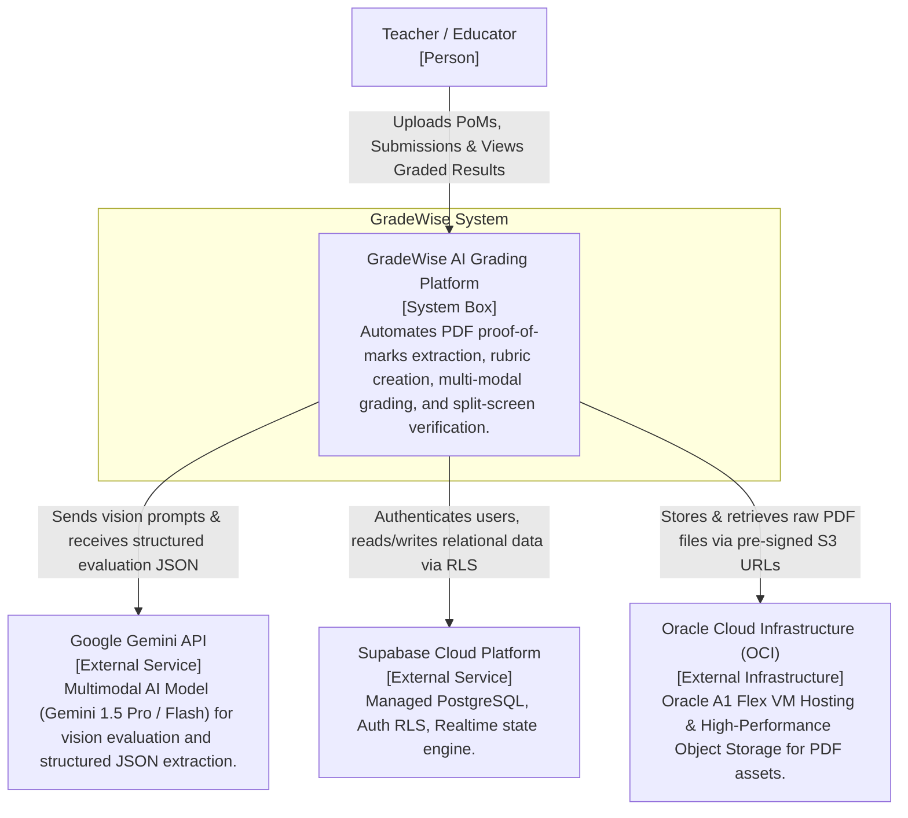
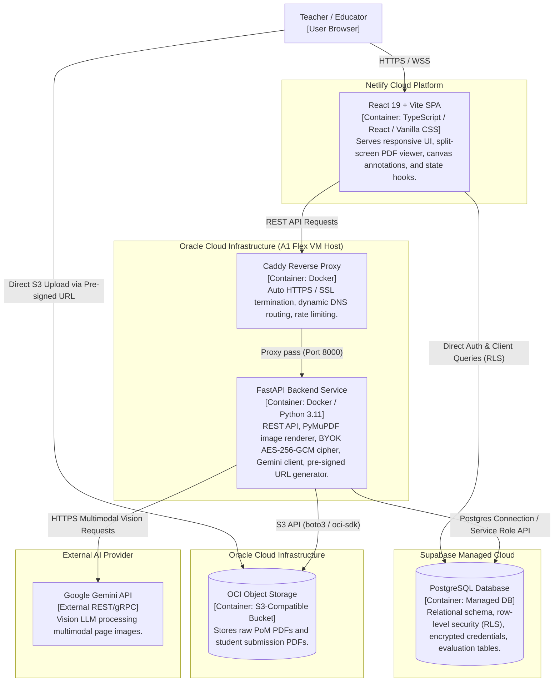
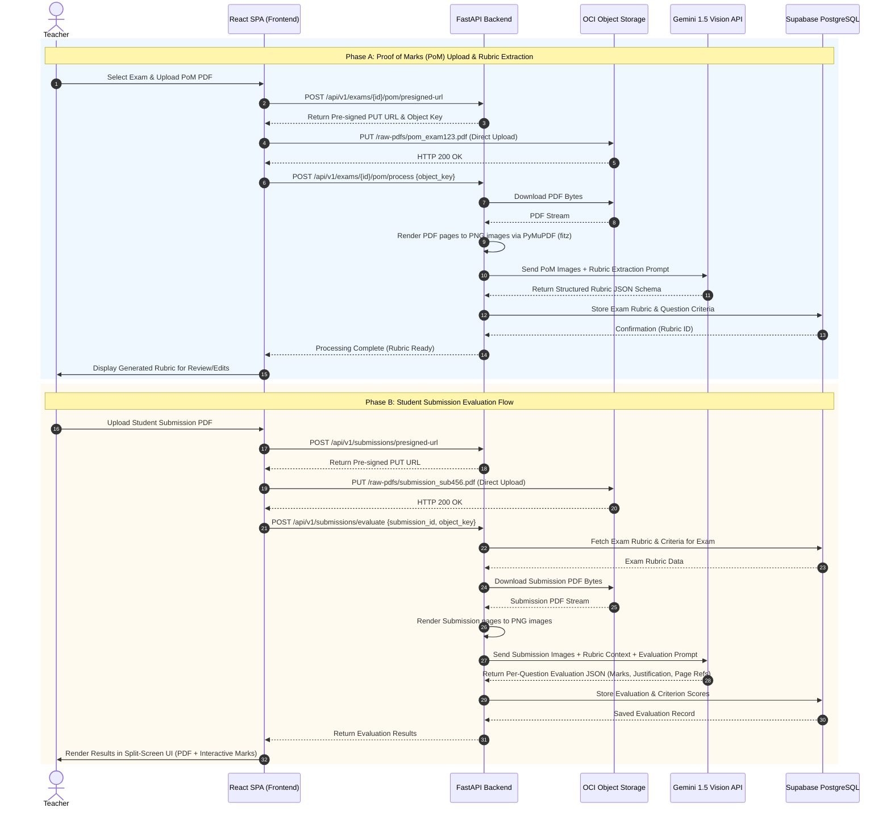
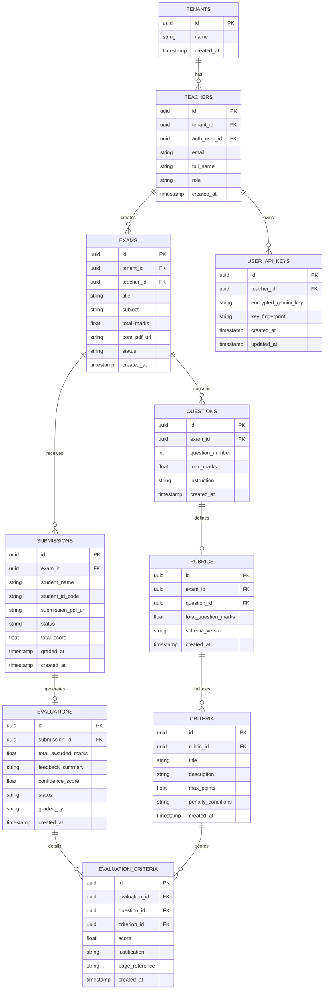
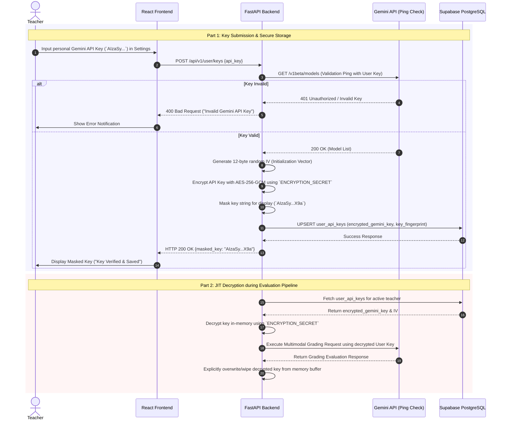

# GradeWise System Architecture & Design Specification

This document details the architectural blueprints, system container boundaries, processing sequence flows, database schema, security BYOK pipeline, and directory layout for **GradeWise**.

---

## 1. System Context Diagram (C4 Context)

The C4 Context diagram illustrates how teachers interact with GradeWise and how GradeWise interfaces with external cloud infrastructure and AI services.



---

## 2. Container Diagram (C4 Container)

The Container diagram breaks down the GradeWise System into its runtime components, communication protocols, and hosting providers.



---

## 3. Processing Pipeline Sequence

This sequence diagram depicts the end-to-end processing pipeline for Proof of Marks (PoM) rubric generation and student submission evaluation.



---

## 4. Database Schema (Entity-Relationship Diagram)

The relational database model enforces tenant isolation, multi-teacher collaboration, structured exam rubrics, and detailed per-criterion evaluation scores.



---

## 5. BYOK (Bring Your Own Key) Security Flow

To respect teacher privacy and manage operational API costs, GradeWise supports BYOK. API keys are encrypted at rest using AES-256-GCM with a server-side `ENCRYPTION_SECRET` and decrypted Just-In-Time (JIT) in memory.



---

## 6. Monorepo Directory Structure

Below is the complete structural layout of the `gradewise` repository:

```
gradewise/
├── CONTEXT.md
├── MASTER_PROMPT.md  
├── TOOLS_AND_SKILLS.md
├── README.md
├── .github/
│   └── workflows/
│       ├── frontend-ci.yml
│       └── backend-ci.yml
├── frontend/
│   ├── src/
│   │   ├── components/
│   │   │   ├── common/
│   │   │   ├── pdf/
│   │   │   ├── rubric/
│   │   │   └── grading/
│   │   ├── pages/
│   │   │   ├── Dashboard.tsx
│   │   │   ├── ExamDetails.tsx
│   │   │   ├── GradingView.tsx
│   │   │   └── Settings.tsx
│   │   ├── hooks/
│   │   │   ├── useAuth.ts
│   │   │   ├── useGrading.ts
│   │   │   └── usePDFViewer.ts
│   │   ├── lib/
│   │   │   ├── supabaseClient.ts
│   │   │   └── api.ts
│   │   └── styles/
│   │       └── index.css
│   ├── public/
│   │   └── favicon.ico
│   ├── index.html
│   └── vite.config.ts
├── backend/
│   ├── app/
│   │   ├── routers/
│   │   │   ├── auth.py
│   │   │   ├── exams.py
│   │   │   ├── rubrics.py
│   │   │   ├── submissions.py
│   │   │   └── keys.py
│   │   ├── services/
│   │   │   ├── gemini_service.py
│   │   │   ├── oci_storage.py
│   │   │   ├── pdf_service.py
│   │   │   └── encryption_service.py
│   │   ├── models/
│   │   │   ├── domain.py
│   │   │   └── schemas.py
│   │   ├── prompts/
│   │   │   ├── pom_rubric_prompt.py
│   │   │   └── submission_eval_prompt.py
│   │   └── utils/
│   │       ├── security.py
│   │       └── logger.py
│   ├── tests/
│   │   ├── test_encryption.py
│   │   ├── test_pdf.py
│   │   └── test_grading.py
│   ├── main.py
│   ├── pyproject.toml
│   └── Dockerfile
├── supabase/
│   ├── migrations/
│   │   └── 20260812000000_initial_schema.sql
│   └── seed.sql
├── docker-compose.yml
├── Caddyfile
└── planning/
    ├── 01_PROJECT_PLAN.md
    ├── 02_TECH_STACK.md
    ├── 03_PROMPT_ENGINEERING_STRATEGY.md
    ├── 04_BYOK_SECURITY_AND_COST.md
    └── 05_ARCHITECTURE_DIAGRAM.md
```
