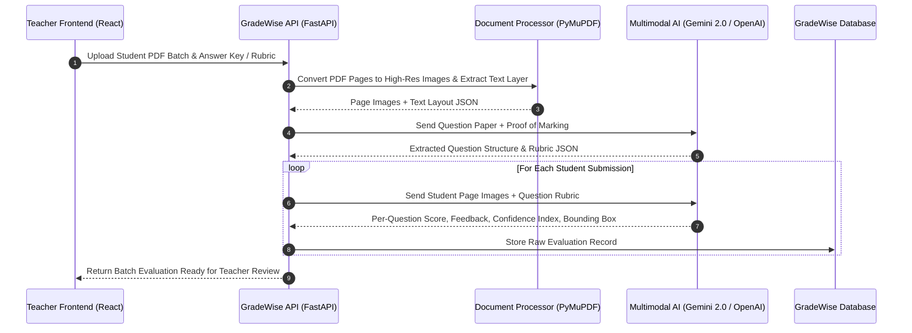

# Research Report 02: AI Tech Stack, Multimodal Vision, & OCR Pipeline

---

## 1. The Challenge of Student Answer Sheets

Student submissions come in diverse forms:
1. **Digital Documents**: PDF or DOCX files generated via word processors. Text extraction is direct via `PyMuPDF` (`fitz`) or `python-docx`.
2. **Scanned & Handwritten Answer Scripts**: Images embedded in PDFs or raw JPEG/PNG scans. Text is handwritten, often with varying handwriting quality, marginal notes, math formulas, and diagrams.

---

## 2. OCR vs. Multimodal LLM Vision Comparison

| Criteria | Traditional OCR (Tesseract / EasyOCR) | Multimodal LLMs (Gemini 2.0 Flash / GPT-4o Vision) | Hybrid Pipeline (GradeWise Approach) |
| :--- | :--- | :--- | :--- |
| **Handwriting Accuracy** | Medium-Low (frequent transcription typos) | High (understands context & cursive script) | **High** (Vision LLM reads images directly) |
| **Diagrams & Schematics** | Fails completely | Interprets logic flow, block diagrams, CPU layout | **High** (Visual understanding preserved) |
| **Cost & Speed** | Very fast (local CPU), $0 API cost | Fast API response, minor per-token cost | **Optimized** (PyMuPDF layout crop + Flash Vision API) |
| **Spatial Bounding Boxes** | Excellent for word/line bounding boxes | Good at region selection when prompted | **Combined** (PyMuPDF page rendering + Vision LLM region mapping) |

---

## 3. GradeWise Document Extraction & Grading Architecture



---

## 4. Prompt Engineering & Rubric JSON Schema

GradeWise enforces strict structured JSON outputs from Vision models using JSON Schema mode.

### **Target Evaluation JSON Schema**:
```json
{
  "student_id": "22BCE11364",
  "student_name": "Divyansh Joshi",
  "evaluations": [
    {
      "question_number": "Q1(a)",
      "max_marks": 5.0,
      "awarded_marks": 4.5,
      "confidence_score": 0.92,
      "rubric_breakdown": [
        {"criterion": "Addressing Modes Definition", "marks_allocated": 2.0, "marks_obtained": 2.0},
        {"criterion": "Example Diagram / Syntax", "marks_allocated": 2.0, "marks_obtained": 1.5, "feedback": "Minor syntax mistake in 32-bit register offset"},
        {"criterion": "Clarity & Completeness", "marks_allocated": 1.0, "marks_obtained": 1.0}
      ],
      "overall_feedback": "Excellent explanation of instruction set formats. Slight oversight on 32-bit indirect addressing.",
      "page_number": 1,
      "bounding_box": {"x": 100, "y": 250, "width": 800, "height": 450}
    }
  ]
}
```
